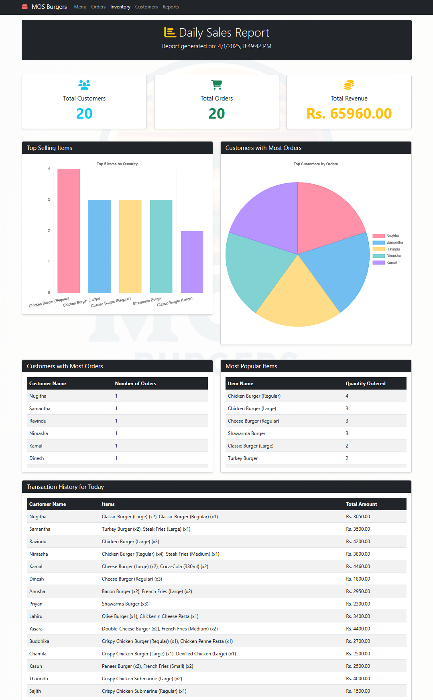

# MOS Burgers 🍔

A modern, responsive web application for streamlining operations at MOS Burgers, a local medium-scale burger shop.

## 📋 Project Overview

MOS Burgers is a client-side web application designed to digitize and optimize the daily operations of a burger shop. This project transforms the paper-based, manual system into an efficient digital solution that handles order processing, store management, bill issuing, and customer management.

## ✨ Features

### Store Management
- Comprehensive catalog of food items with categorization
- Food item details including price, quantity, expiration dates, and unique codes
- Add, update, and delete food items
- Expiration notification system

### Order Management
- Intuitive item selection by name, code, or category
- Interactive shopping cart with real-time price calculations
- Order-wide discount application
- Previous order lookup and management
- Automated receipt generation

### Customer Management
- Customer information tracking
- Customer profile management
- Order history by customer

### Reporting
- Monthly sales reports
- Customer loyalty tracking
- Annual sales and inventory reports

## 🛠️ Technologies

- **HTML5**: Semantic structure
- **CSS3**: Responsive design with modern styling
- **JavaScript**: Dynamic functionality and data management
- **LocalStorage API**: Client-side data persistence
- **GitHub Pages**: Deployment and hosting

## 🖼️ Screenshots

### Home Page

*The welcoming interface of MOS Burgers with navigation to key features*

### Menu Management

*Comprehensive food item management interface*

### Order Processing

*Interactive order creation with real-time calculations*

### Customer Dashboard

*Customer information management and order history*

### Reports

*Visual data representation for business insights*

## 🚀 Getting Started

### Prerequisites
- Any modern web browser (Chrome, Firefox, Safari, Edge)

### Installation
1. Clone this repository
   ```
   https://github.com/Nugi29/MOS-Burgers.git
   ```
2. Open `index.html` in your browser

### Live Demo
Visit the live application: [MOS Burgers Web App](https://yourusername.github.io/mos-burgers/)

## 📊 Project Structure

```
mos-burgers/
├── index.html
├── Script/
│   ├── menuScript.js
│   ├── inventoryScript.js
│   ├── ordersScript.js
│   ├── customerScript.js
│   └── reportsScript.js
└── assets/
    └── logo.jpeg
```

## 🌟 Future Enhancements

- Online ordering system for customers
- Inventory management with automatic reordering
- Employee scheduling and management
- Integration with payment gateways
- Mobile application development

## 👤 Author

Created by Nugitha Disas as a project for Web Development.
---

⭐️ From [Nugi29](https://github.com/Nugi29)
